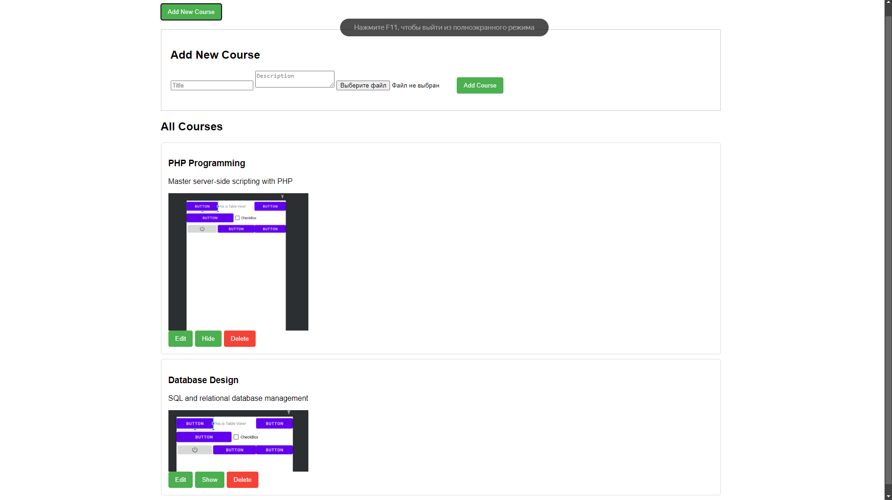
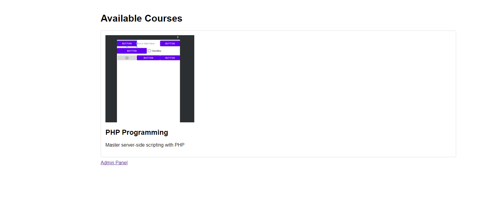

# web-task-1

## task

Создать две страницы.
На первой странице выводить информацию про курсы: название, описание, картинку.
На второй странице создать следующие блоки:

- блок под добавление нового курса
- блок под редактирование курс
- блок с выводом всех курсов и тремя кнопками:

1. изменить курс
2. изменить статус демонстрации (показывать в общем списке пользователем/
   не отображать)
3. удалить
   Блок добавления нового курса отображается только в том случае, если пользователь нажал
   на кнопку добавить.
   Блок редактирование открывается с информацией по выбранному пользователем курса – по
   событию клика по кнопке «Редактировать» напротив конкретного курса.
   При клике по кнопке «Удалить курс», строка с данным курсом закрашивается серым
   цветом, а вместо кнопки удалить появляется кнопка «Восстановить». После обновления
   страницы – строчка с информацией про данный курс пропадает.
   Все данные про курсы хранятся в БД. Добавление, удаление и редактирование информации
   происходит без перезагрузки страницы.

## screenshots

