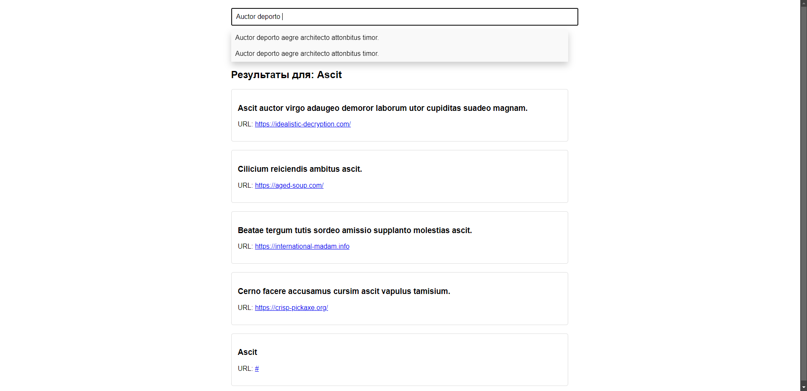

# web-task-2

## task

В БД создать таблицу, которая хранит информацию про запросы.
В таблице хранится следующая информация: id, заголовок, url ссылка.
Создать страницу, на которой есть только одно поле для ввода информации и кнопка
отправить. При вводе более 5 символов, выпадает предварительный список ответов.
При клике по кнопке, на экране выводятся все запросы, которые соответствуют, запросу,
который указал пользователь.

На экран выводится – запрос, который отправил пользователь
Заголовки – которые соответствуют запросу, вместе с текстом

Вывод информации происходит без перезагрузки страницы.

## screenshots

